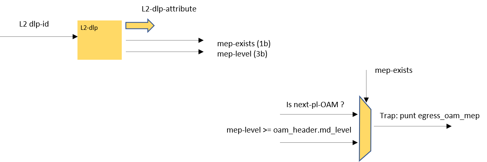
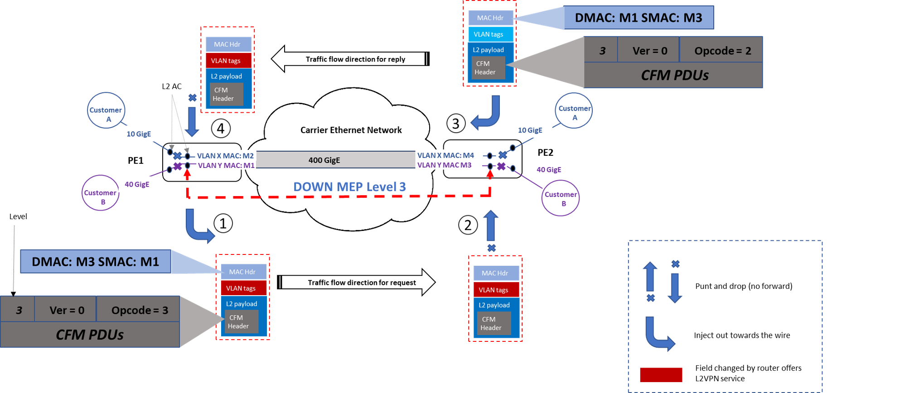

# 731 basic CFM support
For SP 731 release, add the basic CFM support for 3 main scenarios
* Sprint : L2: Physical link and bundle
* Charter: L2VPN, Physical and Bundle ACs (w/ Restrictions). Sub-interfaces (VLAN) on both Physical and Bundle Interfaces

## Definitions
* CFM  - Connectivity Fault Management (IEEE 802.1ag) 
* LACP - Link Aggregation Control Protocol
* PW   - PseudoWire
* PPS - Packets Per Second at a fixed packet size. Also indicates the minimal packet size able to utilize available bandwidth
* Slow Path - control protocol packets processing. Assumed very low pps with no impact on the system PPS / performance 

## Functional Requirements Summary

The entire solution is based on sw offload. This means that datapath requirements is to enable transmit of CFM packets and classify & punt relevant CFM packets on the receiver side

## L2: Physical and Bundle
Using CFM link management protocol to manage bundle management instead of using LACP.
1. Down:Down CFM per link management
2. CFM enabled is attached on the main interface (npp)

### Non Functional Requirements Summary
None
### Architecture

### NOS
* Transceiver: Prepare an inject down pkt destination on one of the bundle interfaces
* Recipient: Out of the bundle aggregation link set configuration for the links that are under connectivity management.
To enable on a selective links of the bundle, it required to allocate a separate l2cp_profile.
Add a new entry with CFM and 8 lsb of the mac DA representing the MD level to the L2CP table. 

### SDK
Expose l2cp-profile in the l2cp table management. 
The l2cp table should serve bundle members that participates in the link-cfm and other l2cp protocols that are shared across other link on the device
The configuration by the NOS is to best utilize the profile to expose the additional link-cfm rule without repeating the general l2cp rules.
example:
| profile       | Per Session Rate | Processing |
| ------------- | ---------------- | ---------- |
| 2'b00         |  l2cp[0]         | gen-L2cp   |
| 2'b00         |  l2cp[1]         | gen-L2cp   |
| 2'b0X	      | link-cfm rule    | link-cfm   |

### Dataplane
Transmit side: None.
Already support inject down to a main interface)
Receiver side: None. Support for punt packet after trapped by the l2cp_trap_table.

### Scale
l2cp trap table already can support this  

## L2VPN, Physical and Bundle ACs
The scenario requires to provide L2VPN customer to verify the connectivity availability of their customer service AC bundle, from core head AC to the core tail AC. 
Using CFM UP-MEP to UP-MEP Charter can offer the AC connectivity check for their customer over Charter pop ASBR routers.

The service is associated with a unique maintenance Domain level so that higher maintenance domains can be set.

### Non Functional Requirements Summary
None
### Architecture

### NOS
* Transceiver: Inject (inject down) CFM packets ready for transmit to their destination over one of the L2VPN bundle interfaces. Packet is ready to transmit (complete packet stack) 
* Recipient: Out of the L2VPN bundle aggregation the packet is transmitted out on the out going l2-dlp. Set on the out-going customer l2-ac MEP exists and the MD level represent the CFM session.
* Manage the CFM packets associated with configured CFM session after punted from dataplane.

* Transceiver: Prepare an inject up pkt to be classified over the same customer AC and send over to the tail end of the L2VPN PW X-Connect tunnel
* Recipient: Configure the relevant customer L2-AC as a EMP and its MD level. Handle all CFM related state management per MEP and session.

### SDK
for L2-AC (dlp) expose whether participate as a MEP in a CFM session and if yes its MD level.

### Dataplane
Transmit side: Support inject up.
Receiver side: Add support at the transmit L2 AC macro (TxPP) the classification of bridge packets as CFM, and redirect / punt packets that match the L2-AC dlp MEP level.

For l2-dlp add attributes 
* mep_exists 1b
* md_level 3b (exists)

#### Processing
Add/ make sure light fi at the TxPP identifies Ethertype 0x8902 as OAM header.

in the transmit mac macro filter add the following checks and if met, punt the packet:
* if dlp_attributes.mep_exists and 
     next pl is OAM and
     dlp.md_level >= pkt.oam_header.md_level

### Scale
None

# L2 X-Connect tunnel, Physical and Bundle ACs
The scenario covers the connectivity check of the SP core network across L2 x-Connect core network. 
Using CFM DOWN-MEP to DOWN-MEP over the core facing L2-AC connectivity check over the core.

The service is associated with a unique Maintenance Domain (MD) level so that higher maintenance domains can be set.

## Non Functional Requirements Summary
None
## Architecture

### NOS
* Transceiver: Inject (inject down) Ethernet CFM packets ready for transmit to their destination over one of the L2 X-Connect bundle interfaces. Packet is ready to transmit (complete packet stack) 
* Recipient: on the in-coming L2-AC of the tail end X-Connect, set l2-slp enabled mep the MD level represent the CFM session.
* Manage the CFM packets associated with configured CFM session after punted from dataplane.  

### SDK
for L2-AC (slp) expose whether participate as a MEP in a CFM session and if yes its MD level.

### Dataplane
Transmit side: Support inject down.
Receiver side: Add support at the ingress source L2-AC in the mac termination macro (RxPP) the classification of bridge CFM packets, and redirect / punt packets that match the L2-AC slp MEP level.

For l2-slp add attributes 
* mep_exists 1b
* md_level 3b (exists)

#### Processing
Add/ make sure ingress fi identifies Ethertype 0x8902 as OAM header.

in the mac termination macro filter add the following checks and if met, punt the packet:
* if lp_attributes.mep_exists and 
     next pl is OAM and
     lp.md_level >= pkt.oam_header.md_level

## Scale
None

## Limitations
No HW acceleration (npu-host) is implemented.
Hence expected processing is 
| Feature       | Per Session Rate | Processing | P4 Scale  |
| ------------- | ---------------- | ---------- | --------- |
| Link Bundle   | 100ms-10min      | SW / NOS   | N/A       |
| L2VPN CFM     |  > 10sec         | SW / NOS   | 100 LP/Dev|
| L2 X-Connect  |  > 10sec         | SW / NOS   | 100 LP/Dev|

## Application Notes
  