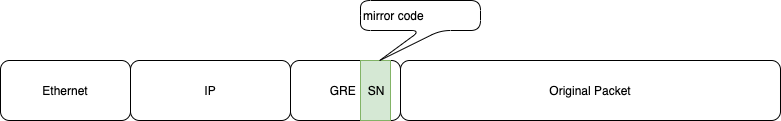

# GRE Sequence Numbering
Add explanation on GRE Sequence Numbering in the GRE header

## Definitions
* GRE - Generic Routing Encapsulation protocol.
* NOS - Network operating System. E.g. XR
* BW - Bandwidth
* PPS - Packets Per Second at a fixed packet size. Also indicates the minimal packet size able to utilize available bandwidth

## Functional Requirements Summary
1. Support stamping consecutive sequence numbers on outgoing packets entering a GRE tunnel.
2. Knob to enable/disable sequence number generation. When enabled the GRE header will contain the Sequence Number fields, and the `S` bit set in the flags.
## Non Functional Requirements Summary
None
## Architecture

### NOS
Upon GRE tunnel configuration, the sequence number flag is to be set to encapsulate a GRE header with Sequence Number option and enable stamping a sequence number in the GRE header. 

### SDK
When the sequence number flag is set, a counter in a lm read enabled block is allocated. The sequence number counter is configured to the mirror code mapping table setting the counter read bit in the counter (bit 19).
The sequence_numbering flag is set in the tunnel properties. 

### Dataplane
GRE sequence numbering is performed in two passes. In the first pass the GRE tunnel headers are encapsulated including a placeholder for the sequence number, which is populated with the tunnel id, and optionally mirror code in case of ERSPAN. Instead of transmitting the packet, it is recycled using the OBM flow.
On the second pass the mirror code or tunnel id are used to retrieve the sequence number counter pointer, counter stamp command as well as traffic management metadata. On the egress, the counter value is stamped.
The following diagram depicts the packet flow, step by step.

1. Overlay packet is routed to the egress slice.
The outgoing packet will be of the form:

2. In case the sequence_numbering flag is set: 
   * The GRE tunnel is encapsulated including the Sequence number option in the GRE header. 
   * Sequence Number field in the GRE header is stamped with the mirror code. 
   * The packet is recycled using the outbound mirror flow (no additional header encapsulated).

The outgoing packet will be of the form:

3. On the receive slice:
   * Mirror code is read from the packet GRE header and mapped to voq, phb and counter. 
   * Destination is set to voq, phb is configured, counter is queued. 
   * In case the counter read is set, a counter stamp command is configured on the NPU header.

The outgoing packet will be of the form:

4. Counter value is read and stamped on the GRE header sequence number field.
The outgoing packet will be of the form:

## Scale
The number of GRE tunnels supporting sequence numbers is machine specific and depends on the number of counter blocks supporting lm read command. The following table depicts the minimal number of sequence number generators per slice.
| Device    | # sequence number generators |
| --------- | ---------------------------- |
| Pacific   |            4K                |
| Gibraltar |            8K                |
| AKPG      |            256               |

## Performance
On Pacific and Gibraltar, when entering a GRE tunnel with sequence numbering enabled, every outgoing packet is recycled and thus processed twice. As a result the PPS and BW are reduced by a factor of two. 

## Limitations
On Pacific, and Gibraltar, bursts of traffic requiring sequence number stamping may result with packet drop. In that case, the sequence number is not incremented.

At first stage Sequence Numbering will only be available on ERSPAN where sequence numbering is implictly added. Thus ERSPAN encapsulation will always have the Sequence Number option in the GRE header, while GRE tunnels will always not have the sequence number option in the GRE header.

## Application Notes
When configuring a GRE tunnel, set the tunnel sequence number counter. The counter must be configured with the counter read command `counter_ptr[19]` and belong to one of the banks supporting lm read. 
On ERSPAN allocate the sequence number counter implictly for each session and set the GRE tunnel sequnece number counter.  