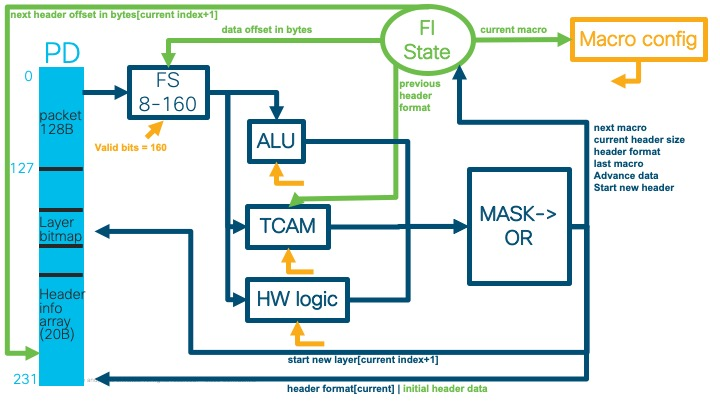
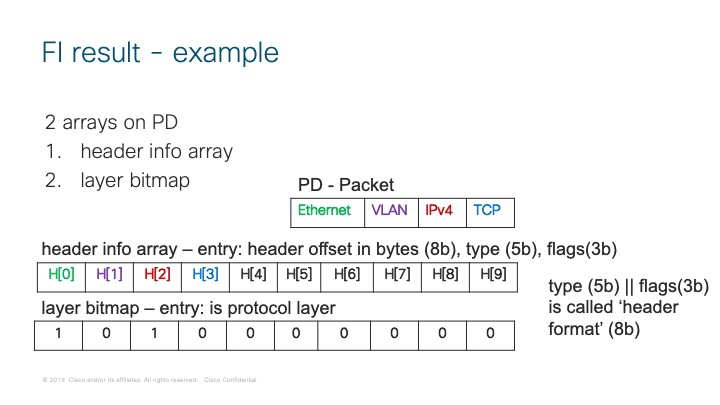
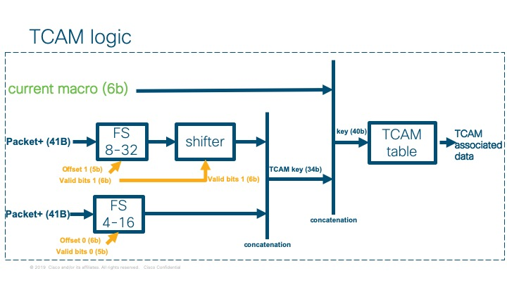
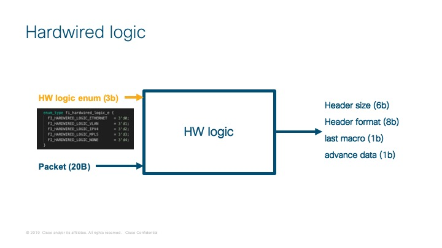
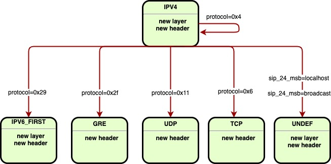
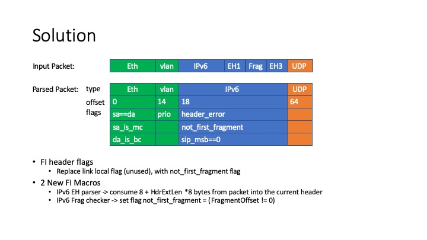
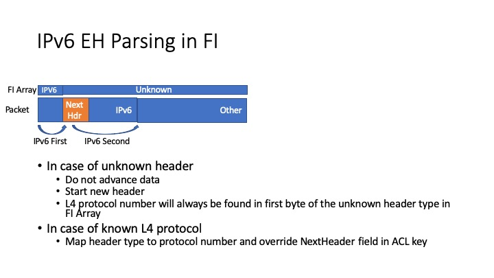
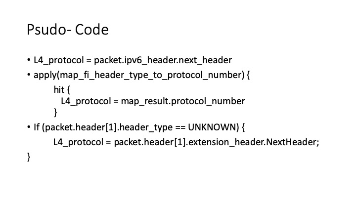
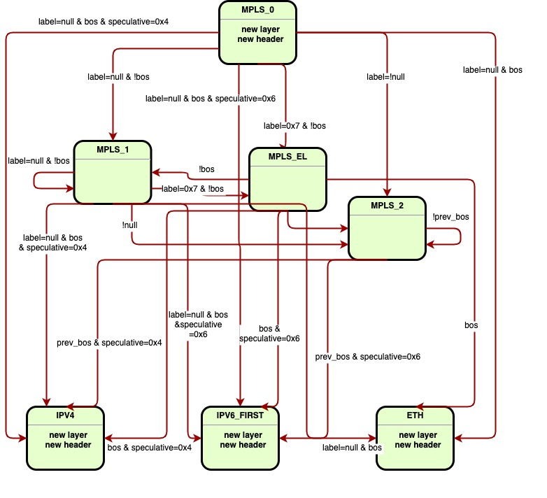
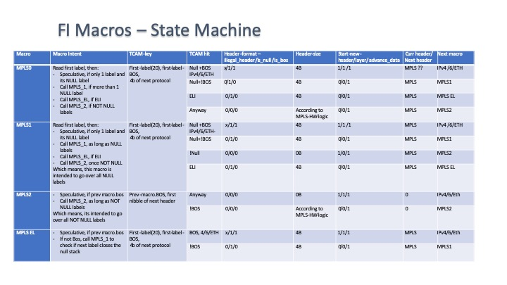

# Packet Parser - Programming Guide

## Internal Overview

The format identifier engine (FIE) identifies the header stack in the packet and populates the format array in the NPPD. For each identified network header the format array entry includes its type, offset from start of packet and additional data that is dependent on the header type (for example, fragmentation indication for IPv4). Four format identifier engines that work in parallel for each IFG allowing identification for an average identification of up to 8 headers at full rate. A packet is assigned to one of the engines where it is processed to completion (each round in the FIE is called a MACRO). The FIE is composed of three parts working in parallel: a TCAM, an ALU and an hardwired logic. Python code is used to define the FI programmable logic - a register based TCAM and a direct table.  

The format array in the NPPD contains the following fields:

|Field Name | Field Size | Field Description |
|------|------|-------------|
|Offset-In-Bytes|8|The offset of the header from start of packet
Type|5|An encoding of the header type. Some values used by the Leaba NPL application are: 0: Unknown 1: Ethernet 4: IPv4 6: IPv6 7: MPLS
Format-Data|3|Protocol specific information. For Ethernet these values contain {DA-is-BC, SA-is-MC, SA-eq-DA}; For IPv4 these values contain {Header-Error, Fragmented, Checksum-Error} For VLAN tags these values contains {Reserved(2), Is-Priority}
Is-Protocol-Layer|1|Each header may be a start of a protocol layer. For example, Ethernet, IPv4, IPv6 and MPLS are a start of a protocol layer. VLAN tags and GRE are not.



### MASK->OR logic:
- next macro = tcam_next_macro
- start new header = tcam_start_new_header
- start new layer = tcam_start_new_layer
- last macro = tcam_last_macro | (hardwired_last_macro & tcam_mask_hardwired_last_macro)
- advance data tcam_advance_data | (hardwired_ advance_data & tcam_mask_hardwired_advance_data)
- Current header format = tcam_header_format | (alu_header_format & tcam_mask_alu_header_format) | (hardwired_header_format & tcam_mask_hardwired_header_format) | initial header data 
- Current header size = tcam_header_size + (alu_header_size & tcam_mask_alu_header_size) + (hardwired_header_size & tcam_mask_hardwired_header_size)

### FI state update:
- current macro (6b) <- next macro
- next header offset in bytes (8b) += current header size
- data offset in bytes (8b) <- next header offset in bytes if advance data
- current header index (4b) +=1 if start new header
- initial header data (header format) <- 0 if start new header else current header format  
- last macro (1b) <- last macro
- *Packet+ (41B)*:

```
+-+-+-+-+-+-+-+-+-+-+-+-+-+-+-+-+-+-+-+-+-+-+-+-+-+-+-+-+-+-+-+-+-+-+-+-+-+
| Packet (20B) | Previous header format (1B) | Packet (20B - wrap around) |
+-+-+-+-+-+-+-+-+-+-+-+-+-+-+-+-+-+-+-+-+-+-+-+-+-+-+-+-+-+-+-+-+-+-+-+-+-+
```

- packet wrap around is used for field selects start of packet bits access
- previous header format is previous: type(5b)||flags(3b)
- *output of the FI stage is a 10-entry array allowing for indexing into the packet*:

```
packet.protocol_layer[current].header[2].vxlan_header.vni
```

- access is usually relative to 'current' protocol layer



### FI technical info

- compilation is required to observe changes in the FI code

### Headers definitions

- each header is a python class composed of fields
- each field is defined by it's offset from the start of the header and the field width in bits
- example:

```
class EthernetHeader():
    da = Field(offset=0, width=48)
    sa = Field(offset=48, width=48)
    ether_type_or_tpid = Field(offset=96, width=16)
```

### flags definitions

- predifined constant flags are used for code readability  
- example:

```
flag_sa_eq_da = 0b001
```

### Macros

- Each MACRO is defined as a python class:

```
class FiMacro():
    def __init__(
            self,
            contexts, # in [NETWORK_CONTEXT, HOST_CONTEXT, FABRIC_CONTEXT, FABRIC_ELEMENT_CONTEXT]
            macro_id, # const value per macro  
            start_header, # is new header True/False
            start_layer, # is new layer True/False
            last_macro=False, # is last macro True/False (True only in UNDEF MACRO)
            header_type=0, # PROTOCOL_TYPE_UNKNOWN  = 5'b00000; , const value per macro  
            offset_from_header_start=0) # offset from start of header start
```

#### TCAM keys



- Each TCAM key is defined by a key name and a specific header field

```
def Key(self, name, packet_field)
```

example:

- 'ether_type_or_tpid' is the TCAM key name
- EthernetHeader().ether_type_or_tpid is the ether_type_or_tpid field in the Ethernet header

```
.Key('ether_type_or_tpid', EthernetHeader().ether_type_or_tpid)
```

#### Hardwired Logic



- Hardwired logic is defined by an hardwired constant and flags

```
def Hardwired(self, hardwired, mask_hardwired_flags=0, mask_hardwired_type=0, mask_hardwired_size=0)
```

example:

- FI_HARDWIRED_LOGIC_ETHERNET is the ethernet hardwired constant  
- mask_hardwired_flags is a mask for the hardwired flags output

```
.Hardwired(FI_HARDWIRED_LOGIC_ETHERNET, mask_hardwired_flags=flag_da_is_bc | flag_sa_is_mc | flag_sa_eq_da)
```

#### ALU


- The ALU is defined by 4 parameters and 3 flags used as ouput mask
- The ALU operation is ( (a << b) + c) << d
- b & d must me const
- a & c can be either a field or a const
- d - decision between: header size (6b) || header format (8b)

```
def ALU(self, a, b, c, d, mask_alu_flags=0, mask_alu_type=0, mask_alu_size=0)
```

example:

- The operation is ( (IPv4Header().hln << 2) + 0 ) << 8 )
- ALU_size = (IPv4Header().hln \* 2) \* 0x3f  

```
.ALU(IPv4Header().hln, 2, 0, 8, mask_alu_size=0x3f)
```

### Conditions

- A series of conditions based on the TCAM keys

```
def Conditions(self, **args)
```

example:

- bos and speculative_next_nibble mask will be 0xf
- label mask and value are implicitly defined  
- .Conditions() specify no conditions  

```
.Conditions(label={"key": 0x0, "mask": 0xffffd}, bos=1, speculative_next_nibble=0x6)
```

#### Actions  

- Each action is a TCAM entry
- default values are derived from the next macro attribute (next macro has to be specified)
- if a certain attribute is specified it will override the default value

```
def Action(self,
            macro,
            next_macro,
            last_macro=None,
            start_header=None,
            start_layer=None,
            advance_data=True,
            mask_alu_flags=None,
            mask_alu_type=None,
            mask_alu_size=None,
            mask_hardwired_advance_data=False,
            mask_hardwired_last_macro=False,
            mask_hardwired_flags=None,
            mask_hardwired_type=None,
            mask_hardwired_size=None,
            header_flags=0,
            header_type=None,
            size=0):
```

example:

- next macro is MPLS_EL
- all attributes will be derived from the next macro (or default value) but the specified: header_flags and size

```
.Action(macro,
            next_macro=MPLS_EL,
            header_flags=flag_is_null,
            size=4)
```

## Identified Packet Headers

### Ethernet

#### Flags

- flag_da_is_bc (ETH - hardwired)
- flag_sa_is_mc (ETH - hardwired)
- flag_sa_eq_da (ETH - hardwired)
- flag_is_priority (VLAN - hardwired)

#### State Diagram


- VLAN_1 is for 2 VLAN headers case

#### Resources used (tcam entries, # macros)

- 1 MACRO min
- 4 MACROS max
- 23 TCAM entries

#### Test cases

### Packet Examples

#### Packet structure and resulting headers

```
Packet structure:
+-+-+-+-+-+-+-+-+-+-+-+-+-+-+-+-+-+-+
| Ethernet | Vlan | Vlan  | payload |
+-+-+-+-+-+-+-+-+-+-+-+-+-+-+-+-+-+-+

header-info array (offset;type;flags):
+-+-+-+-+-+-+-+-+-+-+-+-+-+-+-+-+
| 0;Ethernet | 14;Vlan| 18;Vlan |
+-+-+-+-+-+-+-+-+-+-+-+-+-+-+-+-+

layer bitmap array:
+-+-+-+-+-+-+
| 1 | 0 | 0 |
+-+-+-+-+-+-+
```

### IPv4

#### Flags

- flag_sip_multicast
- flag_header_error (hardwired)
- flag_is_fragmented (hardwired)
- flag_checksum_error (hardwired)

#### State Diagram



#### Resources used (tcam entries, # macros)

- 1 MACRO (without tunnel)
- 8 TCAM entries

#### Test cases

### Packet Examples

#### Packet structure and resulting headers

```
Packet structure:
+-+-+-+-+-+-+-+-+-+-+-+-+-+-+-+-+-+-+-+-+-+-+-+-+
| Ethernet | outer IPV4 | inner IPV4 | payload  |
+-+-+-+-+-+-+-+-+-+-+-+-+-+-+-+-+-+-+-+-+-+-+-+-+

header-info array (offset;type;flags):
+-+-+-+-+-+-+-+-+-+-+-+-+-+-+-+-+
| 0;Ethernet | 14;IPV4 | ?;IPV4 |  
+-+-+-+-+-+-+-+-+-+-+-+-+-+-+-+-+

- IPV4 header size is calculated by an ALU

layer bitmap array:
+-+-+-+-+-+-+
| 1 | 1 | 1 |
+-+-+-+-+-+-+
```

### IPv6

#### Flags

- flag_header_error
- flag_sip_msbs_eq_0
- flag_is_fragmented

#### State Diagram


- extension header







#### Resources used (tcam entries, # macros)

- 2-5 MACRO (without tunnel)
- 35 TCAM entries

#### Test cases

#### Packet Examples

#### Packet structure and resulting headers

```
Packet structure:
+-+-+-+-+-+-+-+-+-+-+-+-+-+-+-+-+-+-+-+-+-+-+-+-+-+-+-+
| Ethernet | Vlan | IPV6 | IPV6 EH1 | Frag | payload  |
+-+-+-+-+-+-+-+-+-+-+-+-+-+-+-+-+-+-+-+-+-+-+-+-+-+-+-+

header-info array (offset;type;flags):
+-+-+-+-+-+-+-+-+-+-+-+-+-+-+-+-+-+
| 0;Ethernet | 14;Vlan |  18;IPV6 |  
+-+-+-+-+-+-+-+-+-+-+-+-+-+-+-+-+-+

layer bitmap array:
+-+-+-+-+-+-+
| 1 | 0 | 1 |
+-+-+-+-+-+-+
```

### MPLS

#### Flags

- flag_illegal_ipv4  
- flag_is_null  
- flag_is_bos

#### State Diagram





#### Resources used (tcam entries, # macros)

- 5 MACRO (without tunnel)
- 22 TCAM entries

#### Test cases

#### Packet Examples

#### Packet structure and resulting headers

### GRE

#### Flags

#### State Diagram


#### Resources used (tcam entries, # macros)

- 1 MACRO  
- 10 TCAM entries  

#### Test cases

#### Packet Examples

#### Packet structure and resulting headers

```
Packet structure:
+-+-+-+-+-+-+-+-+-+-+-+-+-+-+-+-+-+-+-+-+-+
| Ethernet | IPV4 | GRE | IPV4 | payload  |
+-+-+-+-+-+-+-+-+-+-+-+-+-+-+-+-+-+-+-+-+-+

header-info array (offset;type;flags):
+-+-+-+-+-+-+-+-+-+-+-+-+-+-+-+-+-+-+-+-+
| 0;Ethernet | 14;IPV4 | ?;GRE | ?;IPV4 |  
+-+-+-+-+-+-+-+-+-+-+-+-+-+-+-+-+-+-+-+-+

- IPV4 header size is calculated by an ALU

layer bitmap array:
+-+-+-+-+-+-+-+-+
| 1 | 1 | 0 | 1 |
+-+-+-+-+-+-+-+-+
```
