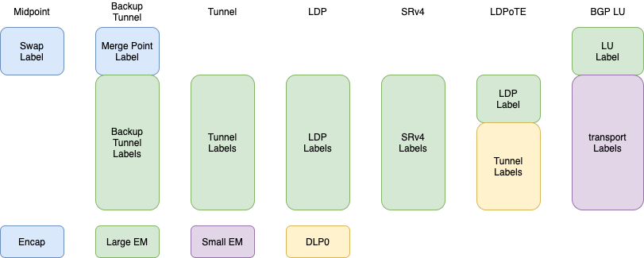
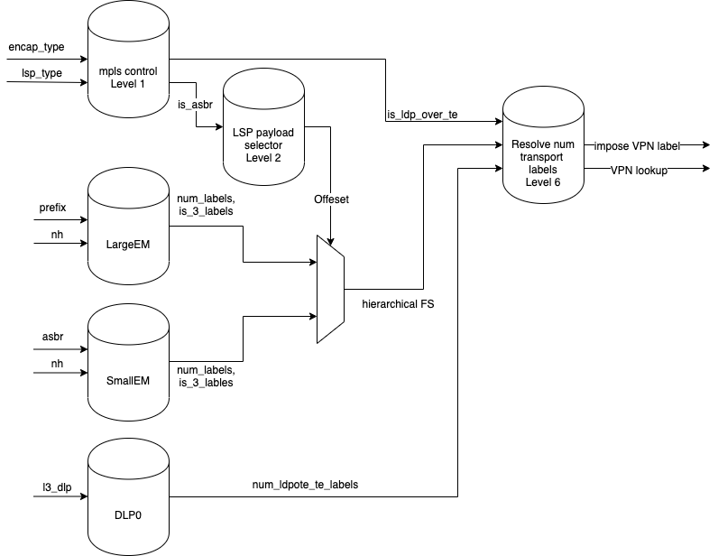
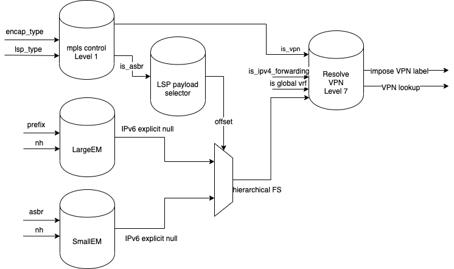

# MPLS Encapsulation Flow+

## Definitions

## References
Reference to Requirements and Architecture doc.

## Detailed Design

### Macro Flow
The MPLS transmit always performs 2 macros. The first is the MPLS transport macro where the transport labels, dlp and nh are resolved.
The second is the IP ACL macro in case of PHP into IP, or the MPLS QoS and Service macro otherwise.

The following MPLS encapsulation flows are support:
* Midpoint - In which a single MPLS label is imposed. Labels is copied directly from encapsulation data in the NPU header.
* Backup Tunnel - In which a merge point label is imposed directly from encapsulation data in NPU header followed by a backup tunnel label extracted from the `<tunnel,nh>` lookup in the Large EM.
* TE Tunnel - A label is imposed from the `<tunnel,nh>` lookup in the large EM
* LDP - An LDP label is imposed from `<prefix,nh>` lookup in Large EM
* SRv4 - An SID label is imposed from `<prefix>` lookup in Large EM
* LDPoTE - An LDP label is imposed from `<prefix,nh>` lookup in Large EM, followed by up to two tunnel labels extracted from `<tunnel,prefix>` lookup in DLP0.
* BGP LU - An LU label is imposed from `<ASBR,DPE>` lookup in the Large EM followed by LDP/SR labels from the `<ASBR,nh>` or `<ASBR>` lookup in the small EM.

L3 VPN, additional transport labels and QoS are performed in the QoS and Serivce macro.

### External DB access

#### Bucket 0
|         | Midpoint           | TE or Backup Tunnel | LDP   | SRv4 | LDPoTE | BGP LU |
| ------- | ------------------ | ------------------- | ----- | ---- | ------ | ------ |
| DB      | DLP0               | DLP0                | DLP0  | DLP0 | DLP0   | DLP0 |
| Key     | l3_dlp             | l3_dlp              | l3_dlp|l3_dlp| tunnel,nh | l3_dlp |
| Payload | l3_dlp_attributes  | l3_dlp_attributes   | l3_dlp_attributes  | l3_dlp_attributes  | l3_dlp_attributes + te labels  | l3_dlp_attributes  |

#### Bucket 1
|         | Midpoint   | TE or Backup Tunnel | LDP   | SRv4 | LDPoTE | BGP LU |
| ------- | -----------| ------------------- | ----- | ---- | ------ | ------ |
| DB      | Direct0    | Direct0             | Direct0 | Direct0 | Direct0 | Direct0 |
| Key     | nh         | nh                  | nh    | nh   |  nh    | nh |
| Payload | da         | da                  | da    | da   | da + sa,vlan | da  |

#### Bucket 2
|         | Midpoint   | TE or Backup Tunnel | LDP      | SRv4     | LDPoTE | BGP LU |
| ------- | -----------| ------------------- | -------- | -------- | ------ | ------ |
| DB      |            | Large-EM            | Large-EM | Large-EM | Large-EM | Large-EM |
| Key     |            | tunnel,nh           | prefix,nh| prefix   | tunnel,prefix | asbr,DPE |
| Payload |            | lsp                 | lsp      | lsp      | lsp    | LU label  |

#### Bucket 3
|         | Midpoint   | TE or Backup Tunnel | LDP      | SRv4     | LDPoTE | BGP LU |
| ------- | -----------| ------------------- | -------- | -------- | ------ | ------ |
| DB      |            |                     |          |          |        | Small-EM |
| Key     |            |                     |          |          |        | asbr,nh|
| Payload |            |                     |          |          |        | lsp    |

The payload for each databse is descrived below:
* l3_dlp_attributes

* l3_dlp_attributes + te_labels

* DA

* DA + SA,VLAN

* LSP

* LU

### ENE Macros
The ENE macro stack is resolved in the QoS and Serivice macro. It is determined according to the following control flags configured in the mpls transport macro.
| Flag                 | size | Description | 
| -------------------- | ---- | ----------- | 
| transport_labels     |   1  |  Transport labels exist                      | 
| inner_label          |   1  |  Encap label or LU label exists              | 
| additional_labels    |   1  |  Need to resolve additional transport labels | 
| entropy_label        |   1  |  LSP payload push_entropy_label set          | 
| VPN_label            |   1  |  VPN, 6PE, 6VPE, IPv6 explicit null exists   | 

Following are the possible ene macros to execute based on the above flags. 

* add missing case for VPN + NH Ethernet in case of VPN but no transport labels

In case there are no labels to impose then the first ene macro is the mac rewite ene macro.

In case `transport_labels` is set, transport ENE macros will be according to the following table:
| inner_label | additional_labels | ENE Macro 1 | ENE Macro 2 |
| ----------- | ----------------- | ----------- | ----------- |
|    False    |  False            | mpls_1_to_3 | 0 |
|    True     |  False            | mpls_inner_1_to_3 | 0 |
|    False    |  True             | mpls_1_to_3 | additional_1_6 |
|    True     |  True             | mpls_inner_1_to_3 | additional_1_6 |

In case there's a VPN label and or entropy labels, the first ENE macro will be according to the following table:
| VPN_label | entropy_label | First ENE Macro |
| --------- | ------------- | --------- |
|    False  |       False   | first transport macro |
|    False  |       True    | mpls_el   |
|    True   |       False   | mpls_vpn  |
|    True   |       True    | mpls_vpn_el |

### Transport labels imposition
Transport labels are resolved by the different MPLS encapsulation types. The sources for the labels differs per flow, and may originate from the NPU Header encapsulation data, the Large EM, the Small EM, or the DLP0 database in the MPLS transport macro. Additional transport labels may be resolved in the Service and QoS macro in case the `is_3_labels` flag is not set and `num_labels` is greater than 2 in the lsp payload.

The diagram below depicts the source of the labels per database and the location they are placed on the pd. 

The first label, if present, is referred to as the `inner` label. The rest are the transport labels.

Encap labels are always present. The rest of the labels may be implicit null. 

The lsp payload may be returned on bucket 2 or bucket 3. As a result there may be multiple sources for it. Furthermore, the number of labels being imposed depends on the existence of the encap label, the number of lsp labels, the existence of the BGP LU label, and the number of TE labels in LDPoTE.

The following diagram depicts the control logic for resolving the ene macros, the number of labels to impose, and the size in bytes of the encapsulated data.

### VPN label imposition
VPN impostition will be perfomed in case one of the following conditions is met:
* vpn is set in encapsulation data, encapsulation type is not midpoint, and packet was not IPv4 forwarded over the global VRF.
* IPv6 Explicit Null 

VPN lookup in subsequent macro will be performed in case vpn is set in encapsulation data and not midpoint and not IPv4 forwarding on global VRF

The following diagram depicts the implementation of the settings:

### PHP
In case there's no vpn label to impose and no transport labels and the overlay protocol layer is IP, then the next macro will be the IP acl macro, and fwd_qos_tag will be set to the next protocol DSCP.

### Counters

### API
Specify the API relevant for the feature.
Tables, keys, payloads format.
header_types that are exposed
Traps
### Counters
If there are counters, which group, block and other constraints.
### Error Handling
define the traps raised

## Test Plan
### Good Path
### Bad Path
### Limits Tests
### Performance Tests

## Scale
What are the limiting factors in terms of scale: number of counters, tunnels, ACE, ...
## Performance
What is the expected performance of the feature

## Limitations
Other limitations or conditions where the feature is disabled, contradicts other features ...

