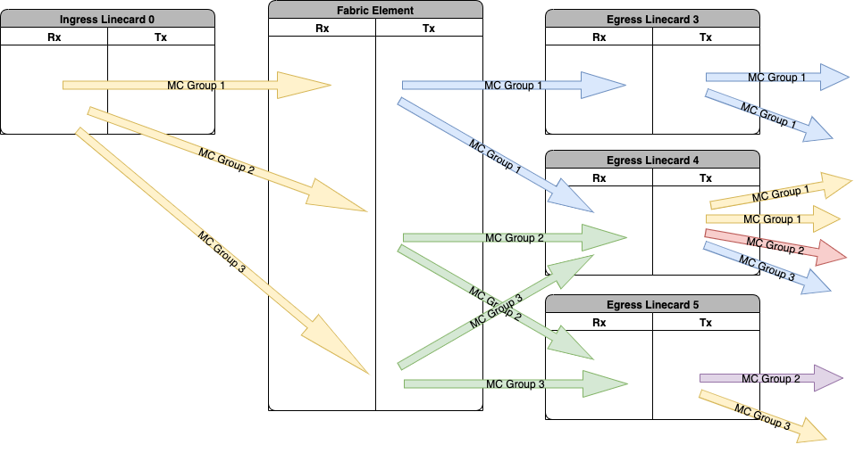
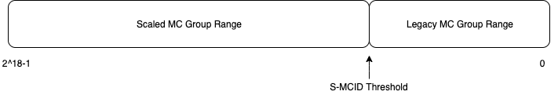

# Scaled Multicast Groups
The pacific HW supports up to 64K multicast **MC** egress replication lists per device. Each replication list is assigned an index named **mcid**. In the naive approach, the NOS allocates each MC group a common global mcid that is distributed to all devices, whether a device has group members or not. With the above approach, each MC group is mapped 1:1 to a HW mcid thus limiting the MC group scale to 64K. For some customers this may not be enough. In addition, fabric element replication lists can be shared for multiple mc groups replicating to the same devices (common sub-tree). 

Assuming that not all multicast groups have members on all devices, the naive approach has mcids that are unused on some or all devices achieving poor utilization of the available egress replication lists. 

We introduce the scaled multicast groups, in which every device, on a distributed system, can utilize almost the entire 64K mcid space, effectively increasing the total number of multicast groups.

## Definitions
* NOS - Network operating System. E.g. XR
* S-MCID - a system multicast ID that represent a unique system wide multicast group in the NOS. The S-MCID is 18b wide and can represent up to 256K unique multicast groups. It is globally allocated by the NOS and distributed to (all) devices containing members of that group.
* mcid - a local mcid is 16b wide and can represent up to 64K unique egress replication lists on a specific device. It is device specific. That is, the SDK on each egress device allocates it's own mcid and maps it to the multicast group.
* BW - Bandwidth
* PPS - Packets Per Second at a fixed packet size. Also indicates the minimal packet size able to utilize available bandwidth
* VOQ - virtual output queue.
* S,G - IPv4/IPv6 Source and multicast group
* VRF - Virtual Router and Forwarding 

## Functional Requirements Summary
1. Provide the ability for the NOS to choose the multicast group mode, either to the legacy non-scaled mode or the scaled mode. An S-MCID configured to the non-scaled mode will have an mcid with the same value as the S-MCID allocated in every device. S-MCID configured to the scaled mode will use the scaled multicast group functionality, in which the SDK optimized the allocation of mcids and P4 maps the multicast group as identified by either the S-MCID or S,G to an mcid on each device. 
2. Specify a scaled multicast group threshold on S-MCID range. S-MCID below the threshold will be processed in the legacy non-scaled multicast group mode. S-MCID above the threshold will processed in the scaled multicast group mode 

## Non Functional Requirements Summary
1. Support scaled mode on Distributed systems
2. Support non-scaled mode on Distributed systems
3. Support non-scaled mode on Fixed systems.
4. Minimal impact on BW and PPS

## Architecture
In the legacy mode, each MC group has a unique system wide mcid allocated. The same mcid is allocated in all the devices, even if there are no members on that device.

The above diagram depicts the mcids of 3 distinct multicast groups across several devices. The color coding represents unique mcid.

In the scaled mode, every common replication list on every device is allocated with the same mcid. At the Rx of every device in the multicast path, the MC group is mapped to a locally administered mcid.

Thus, the 3 multicast groups share the same mcid on the ingress linecard. Two of the 3 groups replicate to the same set of devices, thus share the same mcid on the fabric element. On every egress device, each multicast group has a distinct set of members, thus every multicast group gets its own mcid. They can be the same mcid on different devices, but represent a different replication list on the egress device.
### NOS
The NOS is responsible to allocate a unique S-MCID per multicast group, which is globally allocated per system. Allocation of the S-MCID is from one of the following two consecutive ranges. S-MCID using the legacy mode allocated in the low order of the S-MCID range, and S-MCID using the scaled multicast group allocated in the high order of the S-MCID range. NOS will configure the device to the threshold separating the two ranges prior to configuring any multicast groups. The threshold must be smaller than 64K. The S-MCID is configured to each relevant device using the SDK API along with the multicast group and members.  

### SDK
The sdk is responsible to maintain a mapping on every device between the MC group to a local mcid. An mcid is allocated for each distinct set of replication lists on that device. A replication list can be the destination devices on the fabric element, or the members on the egress linecard. Upon configuring a multicast group, the members are transformed into a replication list and checked whether an mcid was allocated for that specific list. In case it is it will be reused, and in case it doesn't a new mcid is allocated if there's one free. In case all available mcids are allocated on a specific device, an error is returned. It is the NOS responsibility to cleanup the multicast group on all other devices.

SDK is expected to initialize the system to operate in legacy mode setting the default S-MCID threshold to 64K-1. 
### Dataplane
On the ingress device, the S,G on the relevant VRF is mapped to the S-MCID which is stored on the packet metadata (NPU header). This will ensure the S-MCID is available for all the transient devices in the multicast tree.
In the figure below, the packet flow is depicted for both the scaled mode and the legacy mode. The legacy mode behavior is unchanged.

In the scaled mode:
* On the ingress network slice, IRPP, the S-MCID is mapped to mcid `0xFFFF` representing replication to fabric. The actual fabric slice is chosen by hardware load balancing between the available FE links. 
* On the Fabric Element mcid is directly mapped from the S-MCID using the service mapping lp_attributes table on the device. The table is 32K entries shared between a slice pair with 2 read access per cycle generating a 128b payload. The tables is accessed using key `S-MCID[17:3]`, and the mcid is selected using `S-MCID[2:0]`

* On the egress fabric slice, ERPP, the packet is transmitted to a single replica on one of the three network slices. A dedicated mcid per target network slice is used: `0xFFFF`, `0xFFFE`, `0xFFFD`. The network slice is determined from `S-MCID[3:0]` (mapping the 4 lsb into 3 buckets). The three network slice mcids are statically mapped to a single dedicated multicast copy id
*  On the egress network slice ETPP, the dedicated multicast copy id is mapped to a CUD whose scaled_multicast flag is set. As a result the packet will be recycled instead of transmitted.
* Finally, on the egress device network slice RXPP, the S,G on the relevant vrf is used to map to an mcid with local replication list.

The same S,G lookup on a specific device is used in the ingress linecard network slice role and also in the egress linecard network slice role. The S,G lookup returns a single payload that contains both the S-MCID and the local mcid as shown in the figure below. As explained above, at each role a different set of fields from the payload are used.

| Field Name | Field Description          | Width in bits |
| ---------- | -------------------------- | ------------- |
| punt_and_forward | Punt a copy to cpu and forward the packet |     1 |
| punt_on_rpf_fail | Punt the packet to cpu in case of rpf failure. drop otherwise | 1 |
| counter      |  route stats counter                       |   10   |
| smcid        |  System multicast group ID                 |   18   |
| mcid         |  device local mcid                         |   16   |
| expected_src | Expected source logical port for rpf check |   16   |

## Scale
* Up to 256K multicast groups 
* Up to 64K replication lists (multicast sub-trees) per device

## Performance
The PPS on multicast groups is proportional to the number of members in each slice. That is that an incoming packet.
In addition, PPS on multicast groups in the scaled mode also use double the bandwidth of the network slice as on each device a multicast packet is recycled.

## Limitations
Scaled multicast groups are supported for IPv4 and IPv6 <S,G> multicast groups. It is not currently supported for ethernet multicast, nor mLDP.

## Application Notes
* Configure RXPDR to map mcid `0xFFFF` slice bitmap to `0x10` on all network slices. HW recognizes this special value to fabric replication.
* Configure RXPDR to map mcid `0xFFFF` to slice bitmap `0x1`, `0xFFFE` to slice bitmap `0x2` and `0xFFFD` to slice bitmap `0x4` on all fabric slices. On the relevant network slice map the mcid to a special CUD setting the scaled_multicast flag.
* Configure the S,G table with the S-MCID and relevant local mcid on each device.
* Configure direct mapping between S-MCID to the local mcid on each fabric element device.
* Configure scaled multicast S-MCID threshold

In addition, SDK needs to create relevant VOQs, mcid slice replication, mcid CUD mapping and scheduling on the network slices.

