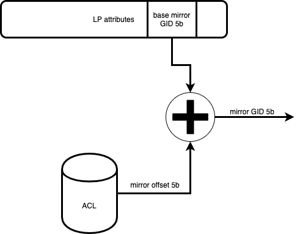

# Multiple ACL SPAN sessions per Logical Port
In order to debug and monitor network traffic through a port, it is required tomirror (copy the contents of a packet) to a different monitoring port. This is call SPAN. The mirrored copy can sent to the NOS on the same system, or can be sent to a remote collector on the network. In the latter case, the original packet needs to be encapsulated with proper network headers destined to the collector. Usually, the encapsulation is through GRE tunnels using an ERSPAN header.

Both incoming and outgoing traffic can be SPANed as depicted in the diagram below.

## Definitions

| Acronym  | Name       | Description |
| ------ | -------------------- | ---------------------------------------------------------------------------------- |
| SPAN   | System Port ANalyzer | A method for copying traffic passing through one port to a different port for debug and monitoring purposes |
| LP     | Logical Port         | A global object representing an interface, sub-interface, BVI, or tunnel interface |
| GID    | Global Identifier    | A system wide unique                                                               |

## Functional Requirements Summary

* Support 4 monitor sessions (any combination of V4 or V6) on a source interface.  Microsoft's use case will have 2 V4 sessions (always-on and on-demand) and 2 V6 sessions on a source interface.  
* Support all four monitor sessions running concurrently.  User can add/delete/modify a monitor session without affecting other monitor sessions.
* The destination address of any single monitor session for the ERSPAN traffic may be either an IPV4 address or IPv6 address.
* ERSPAN traffic can be sent to a non-default VRF.
* Use GRE V4 and V6 encapsulation for mirrored packet transport.
* Support L3 interfaces (physical, bundle, VLAN, BVI). 
* Support ERSPAN ACL and Security ACL.  
* Support rate-limit per monitor session to limit the byte/sec that traffic is sent to an ERSPAN destination.

## Non Functional Requirements Summary

* Support up to 100Gb of mirrored traffic per device

## Architecture

Traffic from many ports can be mirrored to the same destination. Ports with similar mirroring charcterstics, such as the conditions to mirror the traffic, the destination, and packet formats, can be grouped into mirroring sessions. Mirroring is supportted on an interface level (Logical Ports). Each interface can be assigned with multiple mirror sessions that operate on under different packet formats and conditions.

An interface can either unconditionally mirror all traffic, or mirror packets matching specific packet filters. Many filters may be applied, each resulting with a different mirror session. Q100 and Q200 only support a single mirroring session per packet, and in case of multiple interfaces only the last packet is captured.

### NOS

NOS is expected to allocate consecutive sets of mirror GIDs that will be assigned to logical ports (interfaces). Each GID will correspond to a specific ERSPAN session. The minimal GIS is to be configured to the LP. In addition, ACL key/Action profiles must be created for both IPv4 and IPv6 ERSPAN ACLs. Each containing the required key for IPv4 and IPv6 (respectively) and the default action profile. Multiple ACLs using the key/action profile may be defined, and multiple (up to 4) ACLs may be applied in total on each logical port.

### SDK

A basic description of what the SDK will do.
What information will it expect from NOS, and how it is translated to the API provided by P4
This part needs to be ironed out with the SDK.

### Dataplane

Support for multiple mirror sessions on a LP will be achieved by configuring a base mirror GID on the logical port, and an offset to the base GID, resolved from the ACE action, will be added to it. As such, all mirror GIDs set on a logical port must be consecutive.

Unconditional port mirroring will be supported only on the base mirror GID.

Any configured mirror session on a LP may be activated by any ACL on any supported packet format. Any restirictions or classification needs to be managed by the NOS when creating the sessions and configuring ACLs.

Configuring mirror actions with offsets in ACLs is performed on RTF using the default action. As such it may be applied on any ACL whose action profile is the default action profile.

The ACL mirror action can be programmed in one of two modes. In the first mode 'MIRROR_DIRECT', the mirror code is derived from the ACE action. In the second mode, 'MIRROR_OFFFSET', the mirror code is derived from the LP. In that mode, the ACE mirror_code is used as an offset added to the mirror GID configured on the logical port.

| Field Name    | Field width | Description                                                                                  |
| ------------- | ----------- | -------------------------------------------------------------------------------------------- |
| mirror_action | 1           | A selector for the mirror action mode. Either 'MIRROR_DIRECT' with value 0 or 'MIRROR_OFFSET' with value 1.                                                                                |
| mirror_code   | 5           | In direct mode, represents the mirror code used for mirroring. A value of 0 is ignored. In offset mode, represents the offset to the mirror code used for mirroring.                 |

## Scale

* 24 mirror sessions per system.
* 4 ACLs (of all types: ERSPAN, Security, QoS, BGP FS) may be applied on a packet at ingress

## Performance

* Every mirrored packet is a packet that consumes PPS, thus if all packets are mirrored 50% PPS impact.
* PPS drops by a factor of the number of ACLs applied on packet. efer to RTF for deatials.

## Limitations

* All Mirror GIDs applied on a specific interface must be consecutive.
* Only the Base mirror GID can be unconditionally set.
* Only a single mirror takes effect on a packet. In case of multiple ACL matches, the last one applied prevails.

## Application Notes

None
